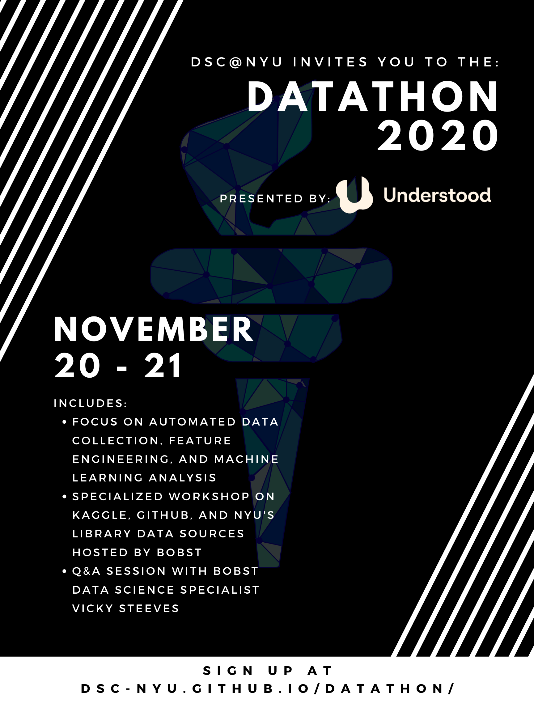

## DSC @ NYU 2020 Datathon
### November 20-21, 2020
Hosted by the Data Science Club at NYU

In association with Understood.org 

### Registration Information
<a href="https://ra2911.typeform.com/to/gJ3vFWCv"> General Registration Form </a>

<a href="https://docs.google.com/spreadsheets/d/1Xo-U0M5wEJKf6N-1oRNrUMldX2mDXP2sQOH-N1oqBPw/edit#gid=140705883"> Still looking for a team? </a>

(If your name doesn't appear on this list, we will assume you have a team)

<a href="https://docs.google.com/spreadsheets/d/1Xo-U0M5wEJKf6N-1oRNrUMldX2mDXP2sQOH-N1oqBPw/edit#gid=0"> Team Registration </a>

(If your name doesn't appear on this list or the previous list, we will assume you are not participating in the datathon)

### Datathon Schedule
<table>
  <tr>
    <th>Time (EST) </th>
    <th>Event</th>
  </tr>
  <tr>
    <td>14:00</td>
    <td></td>
  </tr>
  <tr>
    <td>15:00</td>
    <td></td>
  </tr>
  <tr>
    <td>16:00</td>
    <td></td>
  </tr>
  <tr>
    <td>17:00</td>
    <td></td>
  </tr>
  <tr>
    <td>18:00</td>
    <td></td>
  </tr>
  <tr>
    <td>19:00</td>
    <td></td>
  </tr>
  <tr>
    <td>20:00</td>
    <td></td>
  </tr>
  <tr>
    <td>21:00</td>
    <td></td>
  </tr>
  <tr>
    <td>22:00</td>
    <td></td>
  </tr>
  <tr>
    <td>23:00</td>
    <td></td>
  </tr>
  <tr>
    <td>00:00</td>
    <td></td>
  </tr>
  <tr>
    <td>01:00</td>
    <td></td>
  </tr>
  <tr>
    <td>02:00</td>
    <td></td>
  </tr>
  <tr>
    <td>03:00</td>
    <td></td>
  </tr>
  <tr>
    <td>04:00</td>
    <td></td>
  </tr>
  <tr>
    <td>05:00</td>
    <td></td>
  </tr>
  <tr>
    <td>06:00</td>
    <td></td>
  </tr>
  <tr>
    <td>07:00</td>
    <td></td>
  </tr>
  <tr>
    <td>08:00</td>
    <td></td>
  </tr>
  <tr>
    <td>09:00</td>
    <td></td>
  </tr>
  <tr>
    <td>10:00</td>
    <td></td>
  </tr>
  <tr>
    <td>11:00</td>
    <td></td>
  </tr>
  <tr>
    <td>12:00</td>
    <td></td>
  </tr>
  <tr>
    <td>13:00</td>
    <td></td>
  </tr>
  <tr>
    <td>14:00</td>
    <td></td>
  </tr>
  <tr>
    <td>15:00</td>
    <td></td>
  </tr>
  <tr>
    <td>16:00</td>
    <td></td>
  </tr>
  <tr>
    <td>17:00</td>
    <td></td>
  </tr>
</table>

### Workshop
<iframe width="560" height="315" src="https://www.youtube.com/embed/ua-CiDNNj30" frameborder="0" allow="accelerometer; autoplay; clipboard-write; encrypted-media; gyroscope; picture-in-picture" allowfullscreen></iframe>

### Support Staff Schedule
<table>
  <tr>
    <th>Time (EST) </th>
    <th>Github Support</th>
    <th>FAQ Support</th>
    <th>Understood.com Support</th>
    <th>Library Support</th>
    <th>Team Support</th>
  </tr>
  <tr>
    <td>14:00</td>
    <td></td>
    <td></td>
    <td></td>
    <td></td>
    <td></td>
  </tr>
  <tr>
    <td>15:00</td>
    <td></td>
    <td></td>
    <td></td>
    <td></td>
    <td></td>
  </tr>
  <tr>
    <td>16:00</td>
    <td></td>
    <td></td>
    <td></td>
    <td></td>
    <td></td>
  </tr>
  <tr>
    <td>17:00</td>
    <td></td>
    <td></td>
    <td></td>
    <td></td>
    <td></td>
  </tr>
  <tr>
    <td>18:00</td>
    <td></td>
    <td></td>
    <td></td>
    <td></td>
    <td></td>
  </tr>
  <tr>
    <td>19:00</td>
    <td></td>
    <td></td>
    <td></td>
    <td></td>
    <td></td>
  </tr>
  <tr>
    <td>20:00</td>
    <td></td>
    <td></td>
    <td></td>
    <td></td>
    <td></td>
  </tr>
  <tr>
    <td>21:00</td>
    <td></td>
    <td></td>
    <td></td>
    <td></td>
    <td></td>
  </tr>
  <tr>
    <td>22:00</td>
    <td></td>
    <td></td>
    <td></td>
    <td></td>
    <td></td>
  </tr>
  <tr>
    <td>23:00</td>
    <td></td>
    <td></td>
    <td></td>
    <td></td>
    <td></td>
  </tr>
  <tr>
    <td>00:00</td>
    <td></td>
    <td></td>
    <td></td>
    <td></td>
    <td></td>
  </tr>
  <tr>
    <td>01:00</td>
    <td></td>
    <td></td>
    <td></td>
    <td></td>
    <td></td>
  </tr>
  <tr>
    <td>02:00</td>
    <td></td>
    <td></td>
    <td></td>
    <td></td>
    <td></td>
  </tr>
  <tr>
    <td>03:00</td>
    <td></td>
    <td></td>
    <td></td>
    <td></td>
    <td></td>
  </tr>
  <tr>
    <td>04:00</td>
    <td></td>
    <td></td>
    <td></td>
    <td></td>
    <td></td>
  </tr>
  <tr>
    <td>05:00</td>
    <td></td>
    <td></td>
    <td></td>
    <td></td>
    <td></td>
  </tr>
  <tr>
    <td>06:00</td>
    <td></td>
    <td></td>
    <td></td>
    <td></td>
    <td></td>
  </tr>
  <tr>
    <td>07:00</td>
    <td></td>
    <td></td>
    <td></td>
    <td></td>
    <td></td>
  </tr>
  <tr>
    <td>08:00</td>
    <td></td>
    <td></td>
    <td></td>
    <td></td>
    <td></td>
  </tr>
  <tr>
    <td>09:00</td>
    <td></td>
    <td></td>
    <td></td>
    <td></td>
    <td></td>
  </tr>
  <tr>
    <td>10:00</td>
    <td></td>
    <td></td>
    <td></td>
    <td></td>
    <td></td>
  </tr>
  <tr>
    <td>11:00</td>
    <td></td>
    <td></td>
    <td></td>
    <td></td>
    <td></td>
  </tr>
  <tr>
    <td>12:00</td>
    <td></td>
    <td></td>
    <td></td>
    <td></td>
    <td></td>
  </tr>
  <tr>
    <td>13:00</td>
    <td></td>
    <td></td>
    <td></td>
    <td></td>
    <td></td>
  </tr>
  <tr>
    <td>14:00</td>
    <td></td>
    <td></td>
    <td></td>
    <td></td>
    <td></td>
  </tr>
  <tr>
    <td>15:00</td>
    <td></td>
    <td></td>
    <td></td>
    <td></td>
    <td></td>
  </tr>
  <tr>
    <td>16:00</td>
    <td></td>
    <td></td>
    <td></td>
    <td></td>
    <td></td>
  </tr>
  <tr>
    <td>17:00</td>
    <td></td>
    <td></td>
    <td></td>
    <td></td>
    <td></td>
  </tr>
</table>

### Contact Information

 Aditya Singhal 

 
<a href="https://datascienceclubnyu.slack.com/team/U01CY7M9L07"> Adi's Slack </a>
 
<a href="mailto:adis@nyu.edu"> Adi's Email </a>
 

 Reema Amhaz 

 
<a href="https://datascienceclubnyu.slack.com/team/U01DFL781D0"> Reema's Slack </a>
 
<a href="mailto:reema.amhaz@nyu.edu"> Reema's Email </a>
 

 Kenan Anderson 

 
<a href="https://datascienceclubnyu.slack.com/team/U01D678MFP0"> Kenan's Slack </a>
 
<a href="mailto:kenan.s.anderson@nyu.edu"> Kenan's Email </a>
 

Ethan Assouline 

 
<a href="https://datascienceclubnyu.slack.com/team/U01D6B4FY94"> Ethan's Slack </a>
 
<a href="mailto:ea1808@nyu.edu"> Ethan's Email </a>
 

### FAQ's

When is the event?

 
The event will be Friday 11/20 from 2pm EST to 11/21 5pm EST.
 
----------------------------------------------------------------------------
 

How long is the event?

 
The event will be 27 hours with submissions closing at 5pm EST on 11/21. Working for the entire length of the event is not required. Coordinate with your team to find times that work for everyone.
 
----------------------------------------------------------------------------
 

Where is the event being held?

 
The event will be virtual with all necessary information on this Github page. The workshop for this event which will be streamed on Youtube (link coming soon) will also be found embedded on this page. All other activities will be held on the Zoom for the event at $check_back_for_the_final_zoom_link$. This is where we will first assemble at 2pm ET on Friday. All meetings with event organizers and support staff will be through this Zoom call which will be on for the whole 27 hours. Breakout rooms for each team will also be available for the duration of the event, so you and your members can use the breakout rooms to collaborate and pop in and out of the general lobby to ask questions or to join the fun social events. Basically – you are your team can work in the breakout rooms of the same call, and then chill or ask questions in the general window of the same link.
 
----------------------------------------------------------------------------
 

Who is hosting the event?

 
This event is a 3-way collaboration between Data Science Club @ NYU, Understood.org, and NYU Bobst Library. Understood.org will be running the datathon, providing assistance throughout the event, and evaluating the work of participants. NYU Bobst will be hosting the technical workshop as well as a Q&A. DSC is putting all this together, providing graduate student level tech assistance and managing all teams and other stakeholders.
 
----------------------------------------------------------------------------
 

Where is the workshop being held?

 
The workshop will be premiering Friday morning on this link at $check_back_for_final_time$. The premiere will also be available through the Youtube link  $check_back_for_final_link$. If you have any questions during the workshop premiere feel free to message the "ask-a-librarian" channel on Slack. There will be someone available to answer any questions that may arise. Tech/workshop-related questions will be answered by our Data Science Specialist Librarian Vicky Steeves between 8-9pm ET on Friday and 11am-12pm on Saturday. Other times, the DSC E-board and CDS graduate students may help you out. 
 
----------------------------------------------------------------------------
 

What assistance will be provided during the event?

 
Understood.org staff will be available Friday 11/20 from 2pm EST to 6pm EST. Graduate students will also be available by appointment to provide technical help during designated timeslots throughout the event. A Q&A will also be hosted by NYU Bobst Data Science Specialist Vicky Steeves during the event. E-Board members will be available over Zoom for the full event time. Check the posted schedule for exact times.
 
----------------------------------------------------------------------------
 

What are the prizes?

 
Winning teams will receive Center for Data Science merch as well as networking and internship opportunities with Understood.org.
 
----------------------------------------------------------------------------
 

How is the datathon being judged?

 
Understood.org evaluates the projects of the participants. More information will be provided on the day of the datathon. There will also be a community award for participating throughout the datathon. Refer to the schedule and slack for events hosted with our Director of Events, Kenan Anderson.
 
----------------------------------------------------------------------------
 

When will winners be announced?

 
Top teams will be emailed and winners will be formally announced by the following week.
 
----------------------------------------------------------------------------
 

Who can participate?

 
This event is open to all current NYU students. Being a declared data science major or minor is not required.
 
----------------------------------------------------------------------------
 

How big can my team be?

 
Suggested team size is 3-6 members. You can work solo if you wish.
 
----------------------------------------------------------------------------
 

How do I form a team?

 
If you are looking for teammates, reach out through the Hackathon-Team-Formation channel on slack or grab your friends!. If you have not signed up for the Data Science @ NYU slack yet, the link is: >INSERT SLACK LINK<.
 
----------------------------------------------------------------------------
 

What if I don’t have a team by the start of the event?

 
If you want a team, that mostly will not happen. We will release a google sheet document here soon where you will be able to reach out to anyone else who does not have a team. We will reach out to all registrants not a part of a team by Thursday and ask them to team up if they did not want to work solo.
 
----------------------------------------------------------------------------
 

Where can I sign up?

 
The sign-up for this event is >INSERT TYPEFORM HERE<. If you have a team already formed please sign up below >INSERT TEAM SIGN UP HERE<
 
----------------------------------------------------------------------------
 

Where can I collaborate with my team?

 
Since this is a remote hackathon, feel free to use whatever platform you like. Zoom breakout rooms for each team will be provided. Feel free to hop on and off Zoom at your leisure. Additional recommended platforms include: Discord, Slack, and Github. 
 
----------------------------------------------------------------------------
 

dkjldkjflkdjlkf

